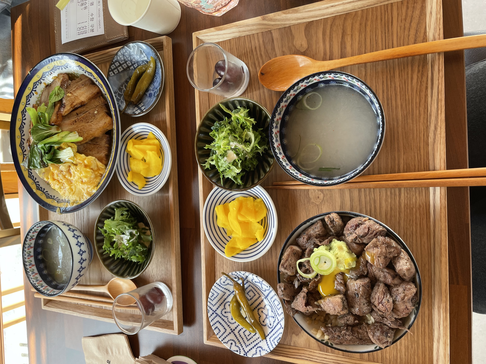

# 🌞 2/12 경주 도착!

인천에서 3시간 30분에 걸쳐 경주에 도착했다 💨

남쪽이어서 그런지 날씨가 굉장히 따뜻했다.

## 🏠 숙소 - 장미여관

머무르게 된 숙소는 장미여관 이라는 게스트하우스였다.

미리 예약했는데, 가격도 저렴해서 가성비 굿이어씀

골목 안쪽에 있어서 조용하고, 한옥이라 분위기가 예뻤다.

우선 숙소에 짐 맡기구 밥먹으러갔당

## 🍚 점심 - 혀기

점심을 먹을 데를 찾으러 황리단길 근처를 돌아다니는데,

이상하게 카페는 많은데 음식점이 적어서, 음식점 마다 웨이팅이 너무 길었다.

여기다 음식점 하나 차리면 장사 진짜 잘 될 것 같다고 생각할 정도로..

그래서 그나마 짧은 곳으로 찾아간 곳이 '혀기'였다.

짬뽕이 메인 같긴 했는데, 후기 보니까 라면스프 맛 난다고 해서.. 덮밥류를 시켰다.

언니는 삼색챠슈동, 나는 스테끼동을 시켰는데 넘나 맛있어씀..! (물론 배도 엄청 고팠지만)

## ☕ 카페 - 로스터리 동경

점심 먹고 지나가다 예뻐보이던 카페에 들렀다.

다행히 사람이 그렇게 많지 않아 유자차, 초코크림 시켰구 금방 나와따..!

커피 시키려다가, 잠 못잘 것 같아서 카페인 없는걸로 시킴.

초코크림은 달달구리 + 고소한 크림맛

## 황리단길

카페까지 든든히 배를 채우고, 본격적으로 황리단길 탐방에 나섰다.

모든 가게가 다 한옥이다..!

언니랑 나는 둘다 P라서 계획없이 그냥 돌아다녔는데,

그러다가 타로집이 눈에 띄어서 타로도 봤음ㅋㅋㅋ

근데 타로는 별로였다. 돈 아까웠음 ㅠㅠ 누구나 말할 수 있는 것들을 말하는 느낌이었음. 담부터는 알아보고 가야지..

지나가다 맛있어보여서 (사실 호랑이가 귀여워서) 볼카츠도 먹어봄!

배가 굉장히 부른 상태였기 때문에 정확한 맛평가는 어려웠지만..

평소 튀김을 좋아하는 나에게도 버거운 기름짐이었다.

한입 물면 탄산을 찾게 되는... 그런 맛...

바로 편의점가서 사이다 사먹어따..

## 첨성대

경주에 왔으니까, 꼭 가줘야하는 첨성대!

중학교 수학여행 이후로 처음 봤는데, 기억이 왜곡된건지 첨성대가 생각보다 엄청 작더라.

귀염귀염한 첨성대

한번만 보는건 아쉬우니 저녁에 한번 더 오기로 했다.

## 🍱 저녁 - 온천집

저녁은 웨이팅이 길어도 맛집엘 가보자..! 하고 웨이팅이 기본 1시간인 온천집에 가기로 했다.

웨이팅보드에 이름을 적고, 너무 다행히도 온천집과 숙소가 가까워서 숙소에 쉬러 갔다.

역시 숙소는 가까운게 최고라는걸 다시한번 깨닫게해줬다...

좀 지친 상태였는데, 누워있다가 나오니 한결 상쾌해졌당.

근데 이게 2인석/4인석이 나뉘어져 있어서 2인 웨이팅이 좀 더 짧은 편인데, 우리 앞 2시간정도 기다린 손님이 컴플레인 거는걸 봤다.

웨이팅을 왜 아날로그 방식으로 하는건지 의문.. 개선이 좀 필요해보였다.

창문에 보이는 바깥 풍경이 일본에 온 것 같은 느낌을 주었다.

우린 얼큰 샤브샤브를 시켰다.

약간 마라향? 카레향? 같은 향이 육수에서 났는데, 처음에는 뭔가 적응이 안되는 맛이었다가, 먹을수록 중독되는 그런 맛이었다.

나머지는 다음에 이어써야지... 😊
