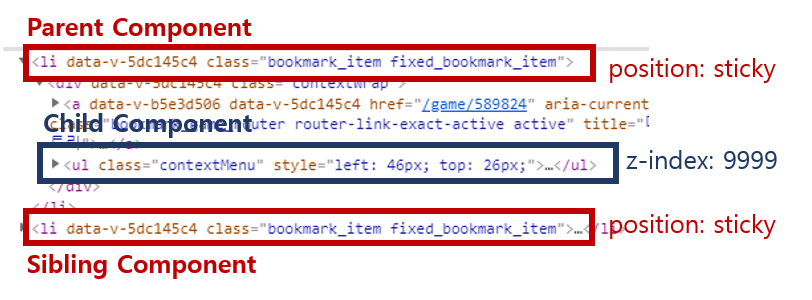

# 문제: position:sticky 내부요소의 z-index가 먹히지 않는다

`position: sticky`인 부모요소 내부에 팝오버 자식요소가 있는 형태인데

자식요소의 z-index를 부모요소의 Sibling Component 보다 높게 주어도 아래에 깔리는 문제가 있었다.

`position: sticky` 를 제거하니 잘 동작해서 이것이 문제임을 알고 찾아보았다.

# 이유: position

[MDN](https://developer.mozilla.org/en-US/docs/Web/CSS/position)에는 position 속성이 다음과 같이 정의되어 있다.

- `static` : z-index 속성의 영향을 받지 않음
- `relative` : z-index가 `auto`가 아닌 경우에, 새로운 Stacking Context를 생성
- `absolute` : z-index가 `auto` 가 아닌 경우에, 새로운 Stacking Context를 생성
- **`sticky`** : **항상 새로운 Stacking Context를 생성**
- **`fixed`** : **항상 새로운 Stacking Context를 생성**

poisition: sticky와 position: fixed 속성은 항상 새로운 Stacking Context를 생성한다고 한다.

> The reason that such elements are stacking contexts is that they need to move with respect to scroll, and in particular composited scrolling layers. Therefore they are put in their own composited layer, andif that layer were not a stacking context, then a lot of unnecessary implementation complexitywould result due to the contents of the fixed/sticky subtree not being atomically rendered.

[그 이유](https://github.com/w3c/csswg-drafts/issues/1053#issuecomment-429511668)는 " 해당 요소들이 스크롤 레이어, 특히 합성 스크롤 레이어와 관련해서 이동해야 하기 때문에, 자체 합성 레이어에 배치된다.

만약 그렇지 않다면 fixed/sticky 하위 트리 내용이 아토믹하게 렌더링되지 않게 때문에 매우 불필요한 구현 복잡성이 발생한다 "

라고는 하는데 정확히 무슨뜻인지는 모르겠다...

따라서 자식 요소가 z-index를 가졌음에도 불구하고, `position: sticky`인 부모 요소의 Stacking Context에 제한되었고,

Sibling Component와 부모 요소는 다른 Stacking Context를 가지기 때문에 Sibling이 부모요소 위에 쌓이게 된 것이다.

# 해결 방법

## 1. 부모의 Stacking Context에서 꺼내기

자식 요소를 부모 바깥으로 옮기면, 부모의 Stacking Context에 제한되지 않아 해결할 수 있다.

## 2. 자식이 있는 부모의 z-index를 Sibling Component 보다 크게 바꾸기

위 예시에서의 팝오버는 click하면 생기고, mouse out하면 없어지는 요소였기 때문에, 위 방법이 가능하지만

만약 계속 존재하는 요소이거나 중복되는 요소라면 위 방법은 불가능하다.

## 3. position 속성 제거 또는 position: sticky / fixed 말고 다른 속성 사용

# 요약

1. position: sticky는 항상 새로운 Stacking Context를 생성한다.
2. 자식 요소는 부모 요소의 Stacking Context에 제한된다.

# 참고: 그 외에도 Stacking Context가 생겨나는 요소들

- 문서의 루트 요소. (`<html>`)
- [position](https://developer.mozilla.org/ko/docs/Web/CSS/position)이 `absolute` 또는 `relative`이고, [z-index](https://developer.mozilla.org/ko/docs/Web/CSS/z-index)가 `auto`가 아닌 요소.
- [position](https://developer.mozilla.org/ko/docs/Web/CSS/position)이 `fixed` 또는 `sticky`인 요소. (`sticky`는 모든 모바일 브라우저에서는 해당하지만 구형 데스크톱 브라우저에서는 해당하지 않음)
- 플렉스([flexbox](https://developer.mozilla.org/en-US/docs/Web/CSS/CSS_Flexible_Box_Layout/Basic_Concepts_of_Flexbox)) 컨테이너의 자식 중 [z-index](https://developer.mozilla.org/ko/docs/Web/CSS/z-index)가 `auto`가 아닌 요소.
- 그리드([grid](https://developer.mozilla.org/ko/docs/Web/CSS/grid)) 컨테이너의 자식 중 [z-index](https://developer.mozilla.org/ko/docs/Web/CSS/z-index)가 `auto`가 아닌 요소.
- [opacity](https://developer.mozilla.org/ko/docs/Web/CSS/opacity)가 1보다 작은 요소. ([불투명도 명세](https://www.w3.org/TR/css3-color/#transparency) 참고)
- [mix-blend-mode](https://developer.mozilla.org/ko/docs/Web/CSS/mix-blend-mode)가 `normal`이 아닌 요소.
- 다음 속성 중 하나라도 `none`이 아닌 값을 가진 요소.
  - [transform](https://developer.mozilla.org/ko/docs/Web/CSS/transform)
  - [filter](https://developer.mozilla.org/ko/docs/Web/CSS/filter)
  - [perspective](https://developer.mozilla.org/en-US/docs/Web/CSS/perspective)
  - [clip-path](https://developer.mozilla.org/ko/docs/Web/CSS/clip-path)
  - [mask](https://developer.mozilla.org/ko/docs/Web/CSS/mask) / [mask-image](https://developer.mozilla.org/en-US/docs/Web/CSS/mask-image) / [mask-border](https://developer.mozilla.org/en-US/docs/Web/CSS/mask-border)
- [isolation](https://developer.mozilla.org/ko/docs/Web/CSS/isolation)이 `isolate`인 요소.
- [webkit-overflow-scrolling](https://developer.mozilla.org/ko/docs/Web/CSS/-webkit-overflow-scrolling)이 `touch`인 요소.
- [will-change](https://developer.mozilla.org/ko/docs/Web/CSS/will-change)의 값으로, 초깃값이 아닐 때 새로운 쌓임 맥락을 생성하는 속성을 지정한 요소.
- [contain](https://developer.mozilla.org/ko/docs/Web/CSS/contain)이 `layout`, `paint`, 또는 둘 중 하나를 포함하는 값(`strict`, `content` 등)인 요소.

# 참조

- [https://developer.mozilla.org/ko/docs/Web/CSS/CSS_Positioning/Understanding_z_index/The_stacking_context](https://developer.mozilla.org/ko/docs/Web/CSS/CSS_Positioning/Understanding_z_index/The_stacking_context)
- [https://developer.mozilla.org/en-US/docs/Web/CSS/position](https://developer.mozilla.org/en-US/docs/Web/CSS/position)
