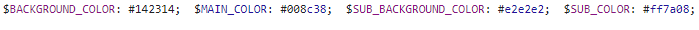

# 목표

`nuxt.js`로 개발 중인 프로젝트가 있다.

이 프로젝트는 동일한 템플릿에 색상만 다르게 입혀 사용하는 경우가 많았다.

테마 색상이 변경될 때, 일일이 변경하지 않고 한번에 변경할 수 있도록 색상 변수들을 전역변수화 하고 싶었다.

단, 색상들을 각각 정의하지 않고 환경변수에 정의한 모든 변수들이 자동으로 등록되기를 원했다.

# 방법

구글링을 해보니 `node-sass-utils` 모듈 사용해서 [js를 sass로 변환하는 방법](https://stackoverflow.com/questions/61617011/how-can-i-use-environment-variables-in-node-sass-scss-files)도 있었는데, 별도의 모듈 없이 구현하고 싶어서 다른 방법을 시도해보게 되었다.

`scss-loader`의 옵션인 `additionalData`를 사용하여 변수를 주입하는 방법을 시도해보게 되었다.

# 적용

우선 환경변수에 색상 변수들을 정의했다.

```jsx
// config/commonEnv.js
const commonEnv = {
	...
  THEME_COLORS: {
    BACKGROUND_COLOR: '#142314',
    MAIN_COLOR: '#008c38',
    SUB_BACKGROUND_COLOR: '#e2e2e2',
    SUB_COLOR: '#ff7a08',
  },
}

export default commonEnv
```

`additionalData`는 스타일 파일 앞에

IIFE 함수를 이용하여

```jsx
//nuxt.config.js
const environment = process.env.APP_ENV
const publicConfig = getPublicConfig(environment)

export default {

  // Build Configuration: https://go.nuxtjs.dev/config-build
  build: {
    ...
    loaders: {
      scss: {
        additionalData: (() => {
          const colors = []
          Object.entries(THEME_COLORS).forEach(([name, value]) => {
            colors.push(`$${name}: ${value}; `)
          })
          return colors.join(' ')
        })(),
      },
    },
  },

  publicRuntimeConfig: {
    ...publicConfig,
  },
}
```

빌드된 결과물을 확인하면, 스타일 파일 앞에 코드가 추가된 것을 확인할 수 있다.


