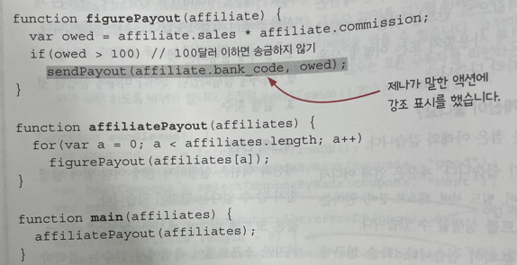

# Chapter 1

## 함수형 프로그래밍의 핵심

함수형 프로그래머는 코드를 액션, 계산, 데이터로 구분합니다.

여기서 액션, 계산, 데이터를 나눠보자.

```bash
{ firstname: "Eric", lastname: "Normand" }
sendEmail(to, from, subject, body)
sum(numbers)
saveUserDB(user)
string_length(str)
getCurrentTime()
[1,10,2,45,3,98]
```

### 1. 액션

- 액션은 호출하는 시점과 횟수에 의존한다.
- 호출할 때 조심해야한다.

```bash
sendEmail(to, from, subject, body)
saveUserDB(user)
getCurrentTime()
```

### 2. 계산

- 계산은 입력값을 계산해 출력하는 것.
- 계산에서 같은 입력값은 같은 출력값을 리턴한다.
- 테스트가 쉽고 몇 번을 호출해도 안전하다.
- 계산은 외부에 영향을 주지 않는다.

```bash
sum(numbers)
string_length(str)
```

### 3. 데이터

- 데이터는 이벤트에 대한 사실을 기록한 것

```bash
[1,10,2,45,3,98]
{ firstname: "Eric", lastname: "Normand" }
```

## 예시

만약 사용자가 작업 완료 표시를 하면 이메일을 통해 알려주는 서비스를 만든다고 생각해보자.

이 서비스에서 액션, 계산, 데이터는 무엇일까?

1. 사용자가 작업 완료 표시를 함 - 액션: UI 이벤트이지만 실행 횟수에 의존
2. 클라이언트가 서버로 메시지를 보냄 - 액션: 메시지를 보내는 것, 메시지 자체는 데이터임
3. 서버가 메시지를 받음 - 액션: 메시지를 받는 것은 횟수에 의존
4. 서버가 데이터베이스를 변경 - 액션: 내부 상태 변경
5. 서버가 누구에게 알림을 보낼지 결정 - 계산: 결정하는 것은 계산임. 입력값이 같다면 항상 같은 결정을 내리므로
6. 서버가 이메일로 알림을 보냄 - 액션: 이메일 보내기는 액션. 같은 메일을 한 번 보내는 것과 두 번 보내는 것은 다름

# Chapter 2

로봇이 운영하는 피자가게를 예시로 들어보자

## 파트 1 미리보기: 액션, 계산, 데이터

1. 액션 - 호출 시점과 횟수에 의존
   - 반죽 펴기
   - 피자 배달
   - 재료 주문
2. 계산 - 어떤 것을 결정, 다른 곳에 영향 X
   - 조리법에 나온 것을 두 배로 만들기
   - 쇼핑 목록 결정
3. 데이터 - 변경 불가능한 테이터
   - 고객 주문
   - 영수증
   - 조리법

### 계층화 설계

변경 가능성에 따라 코드를 나눔


자주 바뀌는것 (위) ←——————→ 자주 바뀌지 않는 것 (아래)

각 계층은 그 아래에 있는 계층을 기반으로 만들어 진다.

따라서 각 계층에 있는 코드는 더 안정적인 기반 위에 작성할 수 있다.

자주 바뀌는 것: 가장 위에 있는 코드는 의존성이 거의 없어서 쉽게 바꿀 수 있고,

자주 안바뀌는 것: 가장 아래에 있는 코드는 의존성이 많아 바꾸기 어렵지만 거의 바뀌지 않는다.

계층형 설계로 만든 코드는 테스트, 재사용, 유지보수가 쉽다.

## 파트 2 미리보기: 일급 추상

### 타임라인 다이어그램


- 액션이 시간 순서에 따라 어떻게 실행되는지 도식화
- 액션은 실행 시점에 의존하기 때문에, 실행 순서가 중요함

### 분산시스템을 타임라인으로?

로봇 한 대가 일하던 일을, 빠르게 처리하기 위해 세 대가 동시에 만든다!

⇒ 로봇 세 대가 각자의 타임라인을 가지고 동시에 일함.

⇒ 각각의 타임라인에서 처리되는 일은 순서가 섞여 누가 먼저 끝날지 알 수 없음

### 각각의 타임라인은 다른 순서로 실행된다.

서로 다른 타임라인에 있는 액션 간 실행순서를 보장할 수 없다.

타임라인을 서로 맞추지 않은 분산시스템은 예측 불가능한 순서로 실행된다!

따라서, 순차적인 프로그램은 분산시스템으로 바꾸기가 어렵다.

다음과 같은 특징이 있다.

1. 기본적으로 타임라인은 서로 순서를 맞추지 않는다.
2. 액션이 실행되는 시간은 중요하지 않다.
3. 드물지만 타이밍이 어긋나는 경우는 일어난다.
4. 타임라인 다이어그램으로 시스템의 문제를 알 수 있다.

### 타임라인 커팅

로봇이 서로를 기다릴 수 있도록 하자.

여러 타임라인이 동시에 진행될 때 서로 순서를 맞추는 방법이다.

점선은 모든 작업이 끝날 때 까지 진행하지 말라는 뜻이다.

### 타임라인에 대해 배운 것

1. 타임라인 커팅으로 서로 다른 작업들을 쉽게 이해할 수 있다.
2. 타임라인 다이어그램을 사용하면 시간에 따라 진행하는 작업을 쉽게 이해할 수 있다.
3. 타임라인 다이어그램은 유연하다. ⇒ 다이어그램을 쉽게 모델링하고, 쉽게 코드로 옮길 수 있다.

# Chapter 3

## 액션, 계산, 데이터

함수형 프로그래머는 액션, 계산, 데이터를 구분한다.

모든 개발과정에서 이를 구분해 볼 수 있다.

1. 문제에 대해 생각할 때
2. 코딩할 때
3. 코드를 읽을 때

## 적용해보기

이는 어디에나 적용이 가능하다.

장보기를 한다고 가정해보면 다음과 같다.

1. 냉장고 확인하기 ⇒ 액션 (시점에 따라 제품이 다름)
2. 운전해서 상점으로 가기 ⇒ 액션 (운전은 한번만 해야함)
3. 필요한 것 구입하기 ⇒ 액션 (구입하는 시점이 중요함)
4. 운전해서 집으로 오기 ⇒ 액션 (집에 오는 시점이 중요함)

그런데 모두 액션? 빠진 게 있는 것 같다.

### 냉장고 확인하기

시점이 중요하기 때문에 **액션**이다. 냉장고에 가지고 있는 제품은 **데이터**이다.

### 운전해서 상점으로 가기

이 행동은 **액션**이지만, 상점 위치로 가는 경로는 **데이터**이다.

### 필요한 것 구입하기

구입하는 일도 **액션**이지만, 필요한 재고에서 현재 재고를 빼는 작업은 **계산**이다.

### 운전해서 집으로 오기

이 단계도 더 나눌 수 있지만, 나누지는 않겠다.

즉 위 과정을 다시 정리해 보면 다음과 같다.


이렇게 하면 액션, 계산, 데이터를 더 많이 찾을 수 있고, 풍부한 모델을 만들 수 있다.

예를 들어서 냉장고 확인 단계도 냉장실 확인, 냉동고 확인 으로 나눠 액션으로 만들 수 있다.

## 장보기 과정에서 배운 것

1. 액션, 계산, 데이터는 어디에나 적용 가능하다.
2. 액션 안에는 계산, 데이터, 또 다른 액션이 숨겨져 있을 수 있다.
3. 계산은 더 작은 계산과 데이터로 나누고 연결할 수 있다.
4. 데이터는 데이터만 조합할 수 있다.
   1. 데이터는 다른 영향을 주지 않으므로
5. 계산은 때로 우리 머릿속에서 일어난다.
   1. 계산이 잘 보이지 않는 이유는 우리 사고에 녹아있기 때문.

## 코드에 적용해보기 - 쿠폰회사

- 쿠폰에 관심 있는 구독자들에게 이메일로 쿠폰을 보내주는 서비스가 있다.
- 친구 10명을 추천하면 더 좋은 쿠폰을 준다
- 이메일 데이터베이스 테이블에 각 사용자 별 추천한 친구 수가 기록돼있다.
- 쿠폰 데이터베이스 테이블에 쿠폰 등급(good, bad, best)이 있다.
  - best: 10명 이상 친구 추천한 사용자에게 주는 쿠폰
  - good: 10명 미만 추천한 사용자에게 주는 쿠폰
  - bad: 사용하지 않는 쿠폰

사용자에게 맞는 쿠폰을 보내는 프로그램을 만든다면 어떻게 될까?

## 쿠폰 보내는 과정 그리기

1. 데이터베이스에서 구독자를 가져오기
   1. 데이터베이스에서 가져오는 과정 - 액션
   2. 가져온 사용자 목록 - 데이터
2. 데이터베이스에서 쿠폰 목록 가져오기
   1. 데이터베이스에서 가져오는 과정 - 액션
   2. 가져온 쿠폰 목록 - 데이터
3. 보내야 할 이메일 목록 만들기
   1. 구독자 목록과, 쿠폰 목록을 토대로 이메일 목록을 만든다
4. 이메일 전송하기
   1. 이메일 목록을 순회하면서 보내기

## 이메일 목록 만들기 자세히 살펴보기

이메일을 보낼 때 본문을 만들어도 되는 건데, 이메일 목록을 계획하는 계산을 하는 이유가 있을까?

함수형 프로그래머는 일반적으로 액션을 사용하지 않으려고 한다.

⇒ 계산을 활용하는 이유는 테스트가 쉽기 때문!

이메일을 실제로 보내고 결과를 주는 시스템 보다,

결과가 이메일 목록 데이터인 시스템이 테스트하기 훨씬 쉽기 때문이다.

(계산은 외부에 영향을 주지 않는다.)

### 이메일 목록 계획하기는 세부적으로 다음과 같이 나눌 수 있다.

먼저 쿠폰 목록을 분류한다.

- 쿠폰 목록에서 good 쿠폰 선택하기
- 쿠폰 목록에서 best 쿠폰 선택하기

어떤 구독자가 어떤 쿠폰을 받을 지 결정하는 계산을 만들 수 있다.

- 구독자 데이터를 통해 쿠폰 등급 결정하기 (rec_count ≥ 10)

## 쿠폰 보내는 과정 구현하기

쿠폰 등급을 결정하는 다이어그램을 구현해보자.

### DB에서 가져온 구독자 데이터

```bash
var subscriber = {
	email: 'sam@pmail.com',
	rec_count: 16
}
```

### 쿠폰 등급은 문자열

```bash
var rank1 = 'best';
var rank2 = 'good';
```

### 쿠폰 등급을 결정하는 것은 함수

```bash
function subCouponRank(subscriber) { // 입력
	if (subscriber.rec_count >= 10) // 계산
		return 'best'; // 출력
	else
		return 'good'; // 출력
}
```

이제 주어진 등급의 쿠폰만 선택하는 부분을 구현해 보자.

### DB에서 가져온 쿠폰 데이터

```bash
var coupon = {
	code: "10PERCENT",
	rank: "bad",
}
```

### 특정 등급의 쿠폰 목록을 선택하는 계산은 함수

```bash
function selectCouponsByRank(coupons, rank) {
  var ret = [];
  coupons.forEach((coupon) => { // 모든 쿠폰에 대해 반복
    if (coupon.rank === rank) {
      ret.push(coupon.code); // 등급이 맞는다면, 쿠폰 코드를 배열에 삽입
    }
  });

  return ret;
}
```

위 함수는 다음과 같은 특징을 가진다.

- 같은 입력값을 줬을 때, 같은 출력값이 나옴
- 그리고 아무리 호출해도 외부에 어떠한 영향을 주지 않는다.

따라서 위 함수는 **계산**이다.

이제 구독자로 이메일을 만드는 부분을 구현해보자.

### 이메일은 데이터

```bash
var message = {
	from: 'abc@nexon.co.kr',
	to: 'efg@nexon.co.kr',
	subject: '제목',
	body: '메일 내용',
}
```

### 구독자가 받을 이메일을 계획하는 계산

이 함수에 인자로는 무엇이 필요할까?

- 구독자 - 구독자에 대한 이메일을 만들어야 함
- 쿠폰 목록 - 이메일에 쿠폰 정보가 있어야 함
  - good, best 쿠폰 목록 - 구독자가 무슨 쿠폰을 받아야 하는지 알 수 없음

```bash
function emailForSubscriber(subscriber, goods, bests) {
  var rank = subCouponRank(subscriber);
  if (rank === "best") {
    return {
      from: "newsletter@coupondog.co",
      to: subscriber.email,
      subject: "Your best weekly coupons inside",
      body: `Here are the best coupons: ${bests.join(", ")}`,
    };
  }
	else // rank === 'good'
	  return {
	    from: "newsletter@coupondog.co",
	    to: subscriber.email,
	    subject: "Your good weekly coupons inside",
	    body: `Here are the good coupons: ${goods.join(", ")}`,
	  };
}
```

이 함수도 계산이다.

- 호출해도 외부에 영향 X
- 같은 입력값은 같은 결과 도출

### 보낼 이메일 목록 준비하기

반복문을 통해 구독자 데이터 리스트를 순회하면서, 위 함수를 호출하면 된다.

### 이메일 보내기는 액션

실제 이메일을 보내는 액션을 구현할 차례이다.

액션도 계산처럼 함수로 구현한다.

## 이미 있는 코드에 함수형 사고 적용하기



sendPayout() 함수는 실제 은행 계좌로 송금하는 액션이다.

이 코드는 함수형 코드라고 하기가 어렵다.

1. sendPayout() ⇒ 돈을 송금하는 함수 ⇒ 액션: 호출 시점, 횟수가 중요
2. sendPayout()을 감싸는 figurePayout() 또한 액션이 된다.
3. 따라서 figurePayout()을 호출하는 affiliatePayout() 도 액션이다.
4. 이를 호출하는 main() 또한 액션

⇒ 따라서 전체 프로그램이 액션이 되었다.

## 액션은 코드 전체로 퍼진다.

위 코드는 잘못되지 않았지만, 함수형 사고가 적용되지 않았다.

액션을 잘못 사용하는 순간, 코드 전체로 퍼져나가기 때문에

함수형 프로그래머는 가능하면 액션을 사용하지 않으려고 한다.

## 액션은 다양한 형태로 나타난다.

함수형 프로그래머는 액션과 계산, 데이터를 구분하지만 많은 프로그래밍 언어에서 액션과 계산, 데이터를 구분하지 않는다.

JS 같은 언어에서 나도 모르게 액션을 호출하고 있을지도 모른다.

### 함수 호출

- alert(”hello world”);
  ⇒ 팝업창이 뜨는 것은 액션이다.

### 메서드 호출

- console.log(”hello”);
  ⇒ 콘솔에 출력

### 생성자

- new Date()
  ⇒ 호출되는 시점에 따라 값이 다름

### 표현식

- 변수 참조: y
- 속성 참조: user.first_name
- 배열 참조: stack[0]
  ⇒ 모두 읽는 시점에 따라 값이 다를 수 있음.

### 상태

- 값 할당: z = 3;
- 속성 삭제: delete user.first_name
  ⇒ 다른 코드에 영향을 줄 수 있다.

이것은 모두 액션이다. 언제, 얼마나 호출하는지에 따라 다른 결과를 낼 수 있다.
