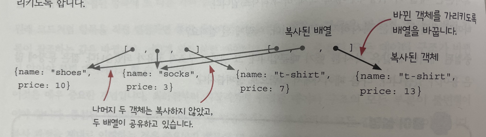

# Chapter 6

## 챕터 요약

- Copy-On-Write는 데이터를 불변형으로 유지할 수 있게 해준다.
- Copy-On-Write는 값을 변경하기 전 얕은 복사를 한다.

## 동작을 읽기, 쓰기로 구분하기

- 읽기 ⇒ 데이터를 바꾸지 않음
- 쓰기 ⇒ 데이터가 변경됨. **불변성 원칙**에 따라 구현해야함 (Copy-On-Write)

Copy-On-Write 원칙 3단계

1. 복사본 만들기
2. 복사본 변경하기
3. 복사본 리턴하기

예시) 장바구니에서 아이템 삭제

```jsx
function remove_item_by_name(cart, name) {
  const new_cart = cart.slice(); // 1) 복사본 만들기
  let idx = null;
  new_cart.forEach((item, index) => {
    if (item.name === name) {
      idx = index;
    }
  });
  if (idx !== null) {
    new_cart.splice(idx, 1); // 2) 복사본 변경하기
  }
  return new_cart; // 3) 복사본 리턴하기
}
```

마찬가지로 splice 동작을 **재사용**할 수 있도록 분리할 수 있다.

```jsx
function removeItems(array, idx, count) {
  const copy = array.slice();
  copy.splice(idx, count);
  return copy;
}

function remove_item_by_name(cart, name) {
  let idx = null;
  cart.forEach((item, index) => {
    if (item.name === name) {
      idx = index;
    }
  });
  if (idx !== null) {
    return removeItems(cart, idx, 1); // 2) 복사본 변경하기
  }
  return cart;
}
```

js배열 메소드들…

length, push, pop, unshift, shift, slice, splice 등등

여담) js 배열은 배열의 동작을 흉내낸 객체.

- 배열 요소의 각각의 메모리 공간이 달라도 됨
- 연속적으로 이어져있지 않아도 됨.

## 쓰면서 읽는 함수 Copy-On-Write 적용하기

shift()

- 쓰기: 맨 앞 요소 삭제
- 읽기: 맨 앞 요소 리턴

1. 읽기와 쓰기 동작으로 분리하는 방법

읽기

```jsx
function first_element(array) {
  return array[0];
}
```

1. 함수에서 두 개 값 리턴하는 방법

```jsx
function shift(array) {
  const array_copy = array.slice();
  var first = array_copy.shift();
  return {
    first,
    array: array_copy,
  };
}
```

1. 불변 데이터 구조를 읽는 것 ⇒ 계산
2. 변경 가능한 데이터를 읽는 것 ⇒ 액션
3. 쓰기는 데이터를 변경 가능한 구조로 만듦
4. 데이터에 쓰기가 없다면, 변경 불가능한 데이터
5. 쓰기를 읽기로 바꾸면 계산이 많아짐

그럼 모든 데이터가 불변형이 된다면, **변하는 상태**는 어떻게 다뤄야 할까?

⇒ **교체**를 통해 바꾼다.

shopping_cart = add_item(shopping_cart, shoes);

3. 쓰기 2. 바꾸기 1. 읽기

## 불변 데이터 구조

⇒ 일반적으로 변경 가능한 데이터 구조보다 메모리를 더 많이 쓰고 느림.

1. 언제든 최적화 가능
2. 가비지 콜렉터는 매우 빠름
3. 생각보다 많이 복사하지 않음 ⇒ 얕은 복사를 사용해 데이터의 최상위 단계만 복사
4. 어떤 함수형 프로그래밍 언어에서는 불변 데이터 구조 지원 ⇒ Clojure에서는 Copy-On-Write 지원

## 객체 복사하기

```jsx
const object_copy = Object.assign({}, object);
```

위 복사를 활용하여 배열과 마찬가지로 Copy-On-Write 를 적용할 수 있다.

## 중첩된 쓰기 Copy-On-Write 적용하기

```jsx
function setPriceByName(cart, name, price) {
	const cartCopy = cart.slice(); // 배열 복사
	cartCopy.forEach((item) => {
		(item.name === name) {
			item = setPrice(item, price);
		}
	}
}

function setPrice(item, new_price) {
	let item_copy = Object.assign({}, item); // 객체 복사
	item_copy.price = new_price;
	return item_copy;
}
```

복사본은 배열 하나, 객체 하나

⇒ 중첩된 데이터에 **얕은 복사**를 함으로써, **구조적 공유**가 되었음



1. 배열 복사 ⇒ 배열을 복사해도, 내부의 객체는 기존 값을 **참조**하고 있음
2. 객체 복사 ⇒ 해당 객체만 복제

⇒ **구조적 공유**: 두 중첩된 데이터 구조에서, 안쪽 데이터가 같은 데이터를 참조

# Chapter 7

## 챕터 요약

- 방어적 복사는 데이터가 들어오고 나갈 때 복사본을 만들어 불변성을 구현한다.
- 방어적 복사는 깊은 복사를 한다.

## 방어적 복사란?

⇒ **불변성이 지켜지지 않는 코드**(ex. 레거시코드)에 데이터를 **전달하기 전/후에 깊은 복사**를 통해서 **원본이 바뀌지 않도록** 막아주는 것

## 방어적 복사 규칙

1. 데이터가 안전한 코드에서 **나갈 때** 복사하기
   1. 불변성 데이터를 위한 **깊은 복사**본 만들기
   2. 신뢰할 수 없는 코드로 전달
2. 안전한 코드로 데이터가 **들어올 때** 복사하기
   1. 변경될 수 있는 데이터가 전달되면, **깊은 복사**본을 만들어 안전한 코드로 전달
   2. 복사본을 안전한 코드에서 사용

## 익숙한 방어적 복사

예시) 웹 API: JSON 데이터 (깊은 복사본) ⇒ API 요청 ⇒ JSON 응답 (깊은 복사본)

⇒ 웹 API는 **방어적 복사**를 한다.

## Copy-On-Write와 비교

|              | Copy-On-Write                                                       | Depensive Copy                                                                        |
| ------------ | ------------------------------------------------------------------- | ------------------------------------------------------------------------------------- |
| 언제 사용?   | 통제할 수 있는 데이터를 바꿀 때                                     | 신뢰할 수 없는 코드와 데이터를 주고 받을 때                                           |
| 어디서 사용? | 안전지대 어디서나                                                   | 안전지대의 경계                                                                       |
| 복사 방식    | 얕은 복사 (비용 ⬇️)                                                 | 깊은 복사 (비용 ⬆️)                                                                   |
| 규칙         | 1. 바꿀 데이터의 얕은 복사 <br/> 2. 복사본 변경<br/> 3. 복사본 리턴 | 1. 안전지대로 들어오는 데이터 깊은 복사 <br/> 2. 안전지대에서 나가는 데이터 깊은 복사 |

## 깊은 복사는 얕은 복사보다 비싸다

- 얕은 복사: 바뀌는 데이터만 복사 ⇒ 바뀌지 않은 데이터는 구조적 공유가 됨.
- 깊은 복사: 모든 데이터를 복사 ⇒ 원본 데이터와 어떤 데이터 구조도 공유하지 않음.

하지만 JS에서 깊은 복사를 구현하는 것은 어렵다.

⇒ lodash 라이브러리에 `.cloneDeep()` 함수를 쓰는 것을 추천

구현 방법: 불변형인 string, number, boolean, function을 제외하고 모든 항목을 **재귀적**으로 돌면서 복사.
